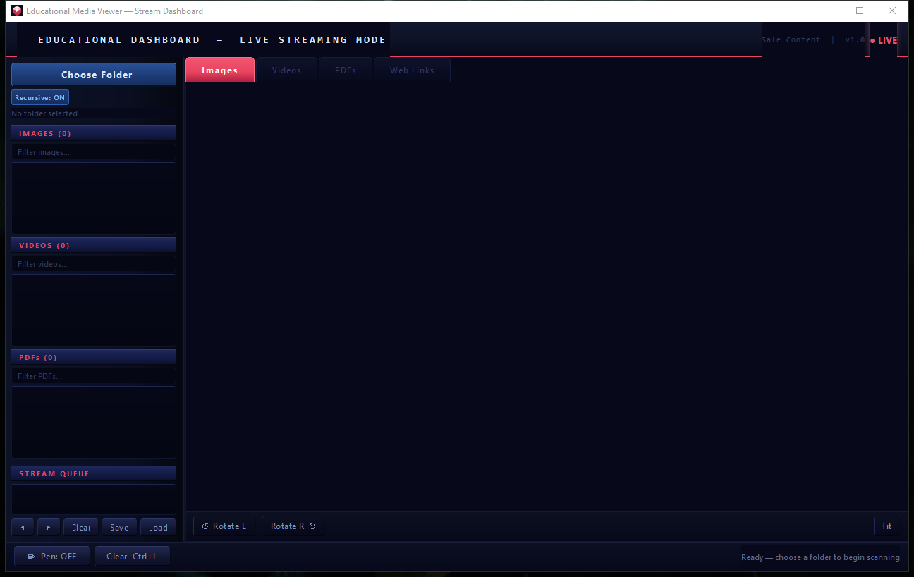

# Educational Media Viewer — Stream Dashboard

A professional PyQt6 desktop application for educators and live-streamers. Scan a folder, browse images, videos, and PDFs in a cinematic dark UI, annotate with a drawing overlay, and queue content for seamless TikTok/live-stream presentations.

---

## Features

- **Folder Scanner** — Recursive or top-level scan for images, videos, and PDFs
- **Image Viewer** — Pan & zoom with smooth scroll-wheel control
- **Video Player** — Full playback with seek bar, volume control, and mute toggle
- **PDF Viewer** — High-DPI rendering, per-page navigation, zoom without blur
- **Drawing Overlay** — Freehand annotation with color presets, custom color picker, and undo
- **Stream Queue** — Right-click any file to add to queue; navigate with ◀ ▶ buttons
- **Live Mode UI** — Pulsing LIVE indicator, broadcast control-room dark theme
- **Keyboard shortcuts** — `Ctrl+O` open folder · `Ctrl+Z` undo · `Ctrl+L` clear canvas

---

## Screenshots



---

## Requirements

```
PyQt6
PyMuPDF
```

Install with:

```bash
pip install -r requirements.txt
```

---

## Run

```bash
python main.py
```

Or **[download the prebuilt EduMediaViewer.exe](https://github.com/etetoo2026/EDU/releases/tag/v1.0)** (Windows, no Python needed).

---

## License

Copyright © 2026 **Mr. Hassan**. All rights reserved.

This project is the intellectual property of Mr. Hassan. Unauthorized reproduction, distribution, or modification is prohibited without explicit written permission.

---

## Author

**Mr. Hassan**  
Portfolio: [mrhassan-dev.vercel.app](https://mrhassan-dev.vercel.app/)
